# PRATIKUM 4 
## PENJELASAN KODE PEMROGRAMAN 

### INISIALISASI LIST
List data_mahasiswa digunakan untuk menyimpan semua data mahasiswa. Setiap data mahasiswa akan disimpan dalam bentuk dictionary dan ditambahkan ke dalam list ini.  

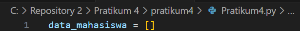

### LOOP WHILE 
- Program memasuki loop while untuk memasukkan data secara berulang. 
- Program meminta input data seperti : Nama, NIM, Nilai Tugas, UAS, UTS yang dikonversi menjadi float agar nilainya menjadi angka desimal. 

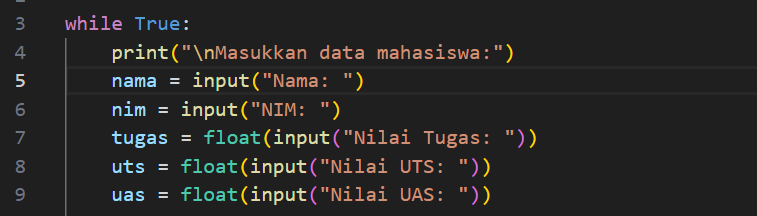

### MENGHITUNG NILAI AKHIR  
Nilai Akhir dihitung berdasarkan bobot : 
- 30% dari nilai tugas 
- 35% dari nilai UTS 
- 35% dari nilai UAS 

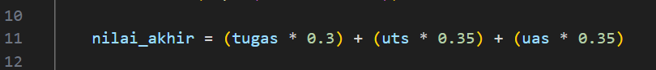

### MENYIMPAN DATA 
- Semua data mahasiswa akan disimpan dalam dictionary. 
- Dictionary ini kemudian ditambahkan ke dalam list data_mahasiswa 

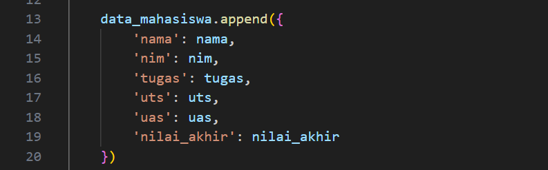

### MENAMBAHKAN DATA ATAU TIDAK 
- Program akan menanyakan apakah kita ingin menambahkan data lagi atau tidak 
- Jika Kita mengetik "y" maka akan perulangan akan dimulai kembali untuk menambah data mahasiswa berikutnya. 
- Jika kita mengetik "t" maka loop while akan dihentikan dengan perintah break 

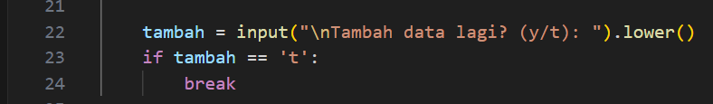

### MENAMPILKAN NILAI 
- Program akan menampilkan judul tabel dan header untuk setiap kolom 
- Garis pembatas dibuat menggunakan print("="*80) 

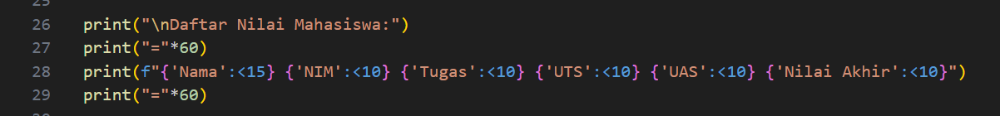

### LOOP 
- Prorgam menggunakan loop for untuk menamppilkan setiap data mahasiswa yang ada di data_mahasiswa. 
- Setiap element dalam list data_mahasiswa adalah dictionary yang merepresentasikan satu mahasiswa. 

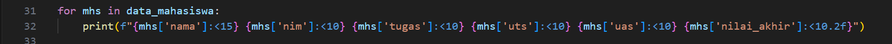

### GARIS PEMBATAS 
Garis pembatas akhir untuk menutup tabel 

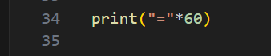

### HASIL PROGRAM
Menampilkan hasil program yang berupa : 
- Nama : 
- NIM : 
- Nilai Tugas : 
- Nilai UTS : 
- NILAI UAS : 

Setelah program akan menanyakan apakah kita ingin menambah data lagi atau tidak. Jika tidak maka program akan menampilkan nilai akhir. 

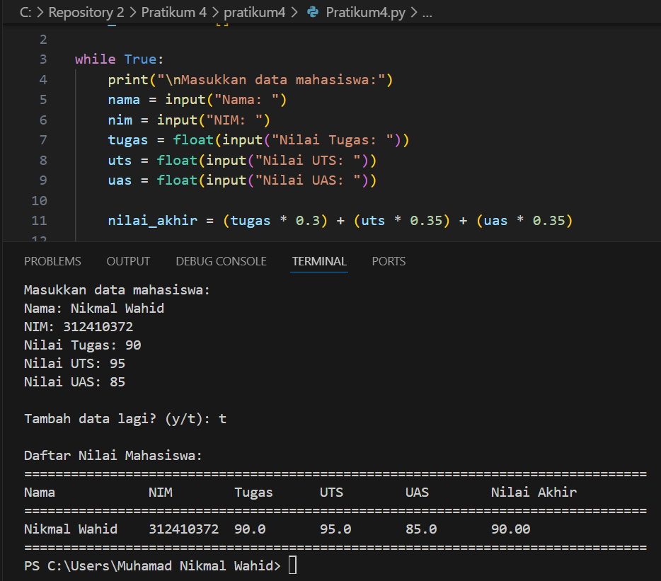

# FLOWCHART 
### MULAI PROGRAM 
- Flowchart dimulai dengan bentuk oval sebagai awal program
- Setelah itu masuk ke proses Masukkan data Mahasiswa 

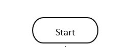

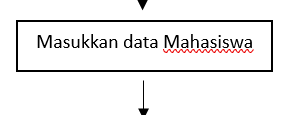

### INPUT DAN DESICION 
- Memasuki proses Input. Disini meminta kita untuk menginputkan NAMA, NIM, Nilai UAS, UTS, dan Tugas. 
- Program akan memasuki Desicion, disini program akan menanyakan apakah kita menambah data lagi, jika ya maka program akan melalukan loop, jika tidak maka akan lanjut ke proses berikutnya. 
- Program akan menghitung Nilai akhir. 30% dari nilai tugas, 35% dari nilai uts, 35% dari nilai uas. 

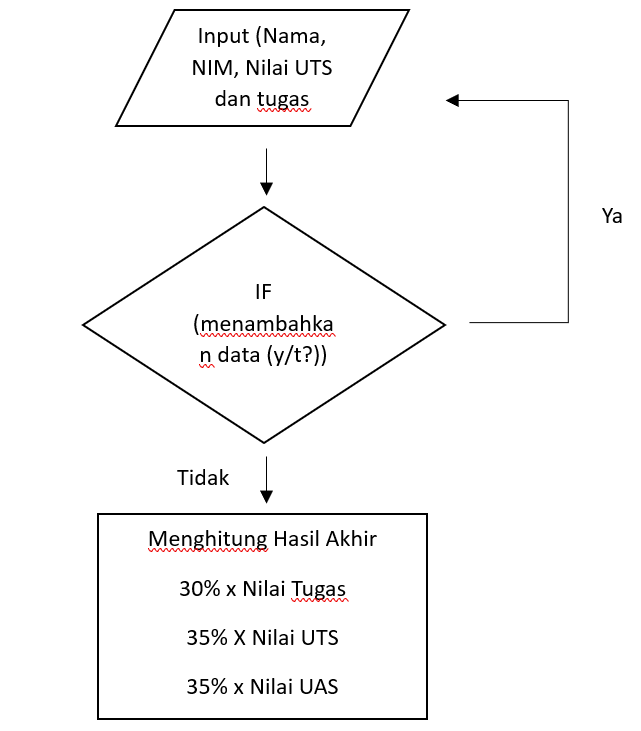

### NILAI AKHIR 
- Program akan menampilkan nilai akhir berupa angka desimal 
- Jika program menampikan sudah nilai akhir, maka progam akan berakhir. 

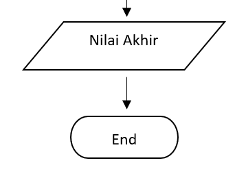
